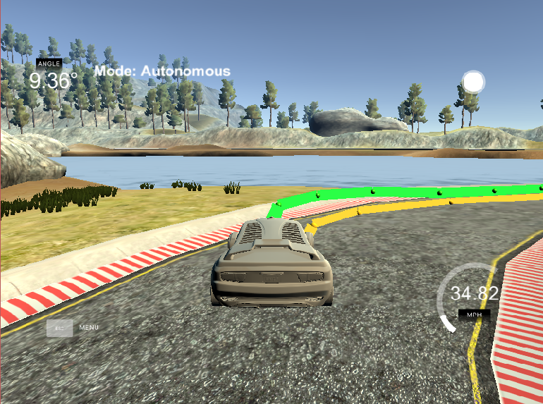

# CarND-Controls-MPC
Self-Driving Car Engineer Nanodegree Program

The final result could be watched on [Youtube](https://youtu.be/9NDoNTZ01Fo)

# Overview
In this project, I try to build an autonomous car by using MPC itself. Model Predictive Control a.k.a Most Popular Control (MPC) is a feedback control algorithm that uses a model to make prediction about future behavior and solves optimization problem to selet the best control action.

MPC can handle multi-input multi-output (MIMO) systems that have interactions between their inputs and outputs. Due to these interactions, it is often challenging to design MIMO systems using traditional controllers such as PID. However, MPC can simultaneously control all the outputs while taking into account input-output interactions. 

# Input
The model read several parameters from the simulator by using JSON, such as:
* `ptsx` (Array<float>) - The global x positions of the waypoints.
* `ptsy` (Array<float>) - The global y positions of the waypoints. This corresponds to the z coordinate in Unity
since y is the up-down direction.
* `psi` (float) - The orientation of the vehicle in **radians** converted from the Unity format to the standard format expected in most mathemetical functions (more details below).
* `x` (float) - The global x position of the vehicle.
* `y` (float) - The global y position of the vehicle.
* `steering_angle` (float) - The current steering angle in **radians**.
* `throttle` (float) - The current throttle value [-1, 1].
* `speed` (float) - The current velocity in **mph**.


# Weight
Initially, I started with the idea of multiply by 10. I apply this idea for the weight hyperparameters. It works well at the beginning. But it started wombling after it passed the 1st bridge.




After that, I try to increase the weight of `cte_weight`, `epsi_weight`, and `v_weight`. However, it became worse where the CTE was barely stable around 0.


So, I try to increase the weight of `diff_delta_weight` and `diff_a_weight` to see the impact. It became stable at first, but started to be wombling after it was passing the bridge and hit the rock.


After several trial and errors, I found that there is a correlation between `cte_weight`, `epsi_weight`, `v_weight`, `diff_delta_weight`, and `diff_a_weight`. The bigger these parameters are, the more stable the car becomes. Furthermore, `diff_delta_weight` and `diff_a_weight` contribute to the stability of the future prediction line, especially on the turn road.

However, if I multiply them too high, it would start wombling again.

So, here is my final hyperparameters:
- `N` - 10
- `dt` - 0.1
- `ref_v` - 40
- `cte_weight` - 10000
- `epsi_weight` - 10000
- `v_weight` - 1000
- `delta_weight` - 10
- `a_weight` - 10
- `diff_delta_weight` - 100000
- `diff_a_weight` - 100000

The detail of `N` and `dt` will be explain below.
The final result could be watched on [Youtube](https://youtu.be/9NDoNTZ01Fo)

# T (predicted horizon), N (timestep), and dt (duration)
For the T predicted horizon (the product of N and dt), I need to make sure that it doesn't too big nor small. If it's too big, it couldn't react to the disturbance fast enough. However, if it's too small, the controller would react to the disturbance quite fast which may cause excessive computational cost.

N determines the number of variables optimized by the MPC. It would be a major driver of computational cost because N determines the length of the control input vector in order to find a low cost vector of control input.

dt determines the approximation step of continuous reference trajectory. The larger it is, the harder it would be to accurately make an approximation. This situation called "discretization error".

For this step, I follow the recommendation from Udacity to determine the reasonable range for T and then tune dt and N appropriately. TO reinforce this idea, I also follow the recommendation [from Matlab Tech Talks](https://youtu.be/dAPRamI6k7Q) to make sure it doesn't too big nor small.

# Polynomial
3rd order polynomial was introduced to calculate CTE that can be found on [MPC.cpp](./src.MPC.cpp) line 142-145

# Latency
In this project, the latency of 100ms was introducted to reflect the latency in the real world. Without latency, the car will conduct the command from the model immediately.

In order to deal with the latency, I use the kinematic model to predict future state as the compromise of the latency before I feed the result into the MPC solver.

---

## Dependencies

* cmake >= 3.5
 * All OSes: [click here for installation instructions](https://cmake.org/install/)
* make >= 4.1(mac, linux), 3.81(Windows)
  * Linux: make is installed by default on most Linux distros
  * Mac: [install Xcode command line tools to get make](https://developer.apple.com/xcode/features/)
  * Windows: [Click here for installation instructions](http://gnuwin32.sourceforge.net/packages/make.htm)
* gcc/g++ >= 5.4
  * Linux: gcc / g++ is installed by default on most Linux distros
  * Mac: same deal as make - [install Xcode command line tools]((https://developer.apple.com/xcode/features/)
  * Windows: recommend using [MinGW](http://www.mingw.org/)
* [uWebSockets](https://github.com/uWebSockets/uWebSockets)
  * Run either `install-mac.sh` or `install-ubuntu.sh`.
  * If you install from source, checkout to commit `e94b6e1`, i.e.
    ```
    git clone https://github.com/uWebSockets/uWebSockets
    cd uWebSockets
    git checkout e94b6e1
    ```
    Some function signatures have changed in v0.14.x. See [this PR](https://github.com/udacity/CarND-MPC-Project/pull/3) for more details.

* **Ipopt and CppAD:** Please refer to [this document](https://github.com/udacity/CarND-MPC-Project/blob/master/install_Ipopt_CppAD.md) for installation instructions.
* [Eigen](http://eigen.tuxfamily.org/index.php?title=Main_Page). This is already part of the repo so you shouldn't have to worry about it.
* Simulator. You can download these from the [releases tab](https://github.com/udacity/self-driving-car-sim/releases).
* Not a dependency but read the [DATA.md](./DATA.md) for a description of the data sent back from the simulator.


## Basic Build Instructions

1. Clone this repo.
2. Make a build directory: `mkdir build && cd build`
3. Compile: `cmake .. && make`
4. Run it: `./mpc`.

## Tips

1. It's recommended to test the MPC on basic examples to see if your implementation behaves as desired. One possible example
is the vehicle starting offset of a straight line (reference). If the MPC implementation is correct, after some number of timesteps
(not too many) it should find and track the reference line.
2. The `lake_track_waypoints.csv` file has the waypoints of the lake track. You could use this to fit polynomials and points and see of how well your model tracks curve. NOTE: This file might be not completely in sync with the simulator so your solution should NOT depend on it.
3. For visualization this C++ [matplotlib wrapper](https://github.com/lava/matplotlib-cpp) could be helpful.)
4.  Tips for setting up your environment are available [here](https://classroom.udacity.com/nanodegrees/nd013/parts/40f38239-66b6-46ec-ae68-03afd8a601c8/modules/0949fca6-b379-42af-a919-ee50aa304e6a/lessons/f758c44c-5e40-4e01-93b5-1a82aa4e044f/concepts/23d376c7-0195-4276-bdf0-e02f1f3c665d)
5. **VM Latency:** Some students have reported differences in behavior using VM's ostensibly a result of latency.  Please let us know if issues arise as a result of a VM environment.

## Editor Settings

We've purposefully kept editor configuration files out of this repo in order to
keep it as simple and environment agnostic as possible. However, we recommend
using the following settings:

* indent using spaces
* set tab width to 2 spaces (keeps the matrices in source code aligned)

## Code Style

Please (do your best to) stick to [Google's C++ style guide](https://google.github.io/styleguide/cppguide.html).

## Project Instructions and Rubric

Note: regardless of the changes you make, your project must be buildable using
cmake and make!

More information is only accessible by people who are already enrolled in Term 2
of CarND. If you are enrolled, see [the project page](https://classroom.udacity.com/nanodegrees/nd013/parts/40f38239-66b6-46ec-ae68-03afd8a601c8/modules/f1820894-8322-4bb3-81aa-b26b3c6dcbaf/lessons/b1ff3be0-c904-438e-aad3-2b5379f0e0c3/concepts/1a2255a0-e23c-44cf-8d41-39b8a3c8264a)
for instructions and the project rubric.

## Hints!

* You don't have to follow this directory structure, but if you do, your work
  will span all of the .cpp files here. Keep an eye out for TODOs.

## Call for IDE Profiles Pull Requests

Help your fellow students!

We decided to create Makefiles with cmake to keep this project as platform
agnostic as possible. Similarly, we omitted IDE profiles in order to we ensure
that students don't feel pressured to use one IDE or another.

However! I'd love to help people get up and running with their IDEs of choice.
If you've created a profile for an IDE that you think other students would
appreciate, we'd love to have you add the requisite profile files and
instructions to ide_profiles/. For example if you wanted to add a VS Code
profile, you'd add:

* /ide_profiles/vscode/.vscode
* /ide_profiles/vscode/README.md

The README should explain what the profile does, how to take advantage of it,
and how to install it.

Frankly, I've never been involved in a project with multiple IDE profiles
before. I believe the best way to handle this would be to keep them out of the
repo root to avoid clutter. My expectation is that most profiles will include
instructions to copy files to a new location to get picked up by the IDE, but
that's just a guess.

One last note here: regardless of the IDE used, every submitted project must
still be compilable with cmake and make./

## How to write a README
A well written README file can enhance your project and portfolio.  Develop your abilities to create professional README files by completing [this free course](https://www.udacity.com/course/writing-readmes--ud777).
